# Google Ads Search Campaign for Vedam Ayurveda

## 📌 Project Overview
This project was developed as part of the **Unified Mentor Internship Program**. It demonstrates the complete process of planning, creating, and documenting a Google Ads Search Campaign for **Vedam Ayurveda**, a premium Ayurvedic skincare brand. The project covers campaign planning, audience targeting, keyword research, ad creation, landing page development, and campaign optimization following Google Ads best practices.

------

## 🏢 Brand Overview
**Brand Name:** Vedam Ayurveda

**Industry:** Premium Ayurvedic Skincare & Wellness

**Hero Product:** Kumkumadi Radiance Face Elixir

**Brand Positioning:**
Vedam Ayurveda is a premium Direct-to-Consumer (D2C) Ayurvedic skincare brand focused on combining authentic Ayurvedic heritage with modern skincare solutions. The flagship product is formulated using Pure Kashmiri Saffron and other natural botanical ingredients to promote healthy, radiant skin.

-----

## 🎯 Campaign Objectives
- Increase brand awareness.
- Drive qualified website traffic.
- Promote Kumkumadi Radiance Face Elixir.
- Reach high-intent skincare consumers.
- Build a premium online brand presence.
  
  ------
  
  ## 👥 Target Audience
- Women aged 25–45
- Tier-1 Indian Cities
- Ayurveda & Wellness Enthusiasts
- Organic & Natural Skincare Buyers
- Premium Beauty Product Shoppers

  -----
  
  ## 🔍 Campaign Highlights
- Google Ads Search Campaign
- Responsive Search Ads
- Keyword Research
- Negative Keyword Strategy
- Audience Targeting
- Budget & Bidding Strategy
- Ad Assets (Sitelinks, Callouts, Structured Snippets & Lead Form)
- Google Sites Landing Page

-------

## 🛠️ Tools Used
- Google Ads
- Google Sites
- Canva
- Google Keyword Planner
- GitHub
- ChatGPT

-----

## 🌐 Landing Page
Live Website:
https://sites.google.com/view/vedamayurvedain/home

----

## 📁 Repository Contents
- Final Project Report (PDF)
- Google Ads Campaign Screenshots
- Landing Page Screenshots
- README.md

---

## 📄 Project Report
Click below to view the complete project report.
### Google Ad Campaign (Imaginary) Report
 Report.pdf)

----

## 📸 Project Screenshots

### Google Ads

### 01. Bidding Strategy

### 02. Location Targeting
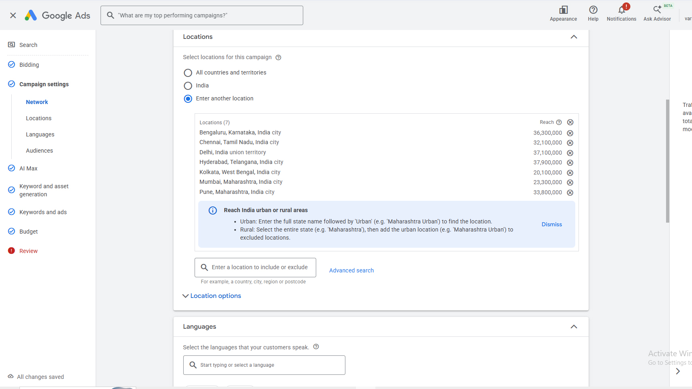

### 03. Audience Targeting
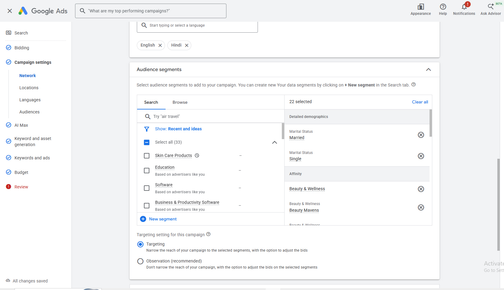

### 04. Campaign Schedule
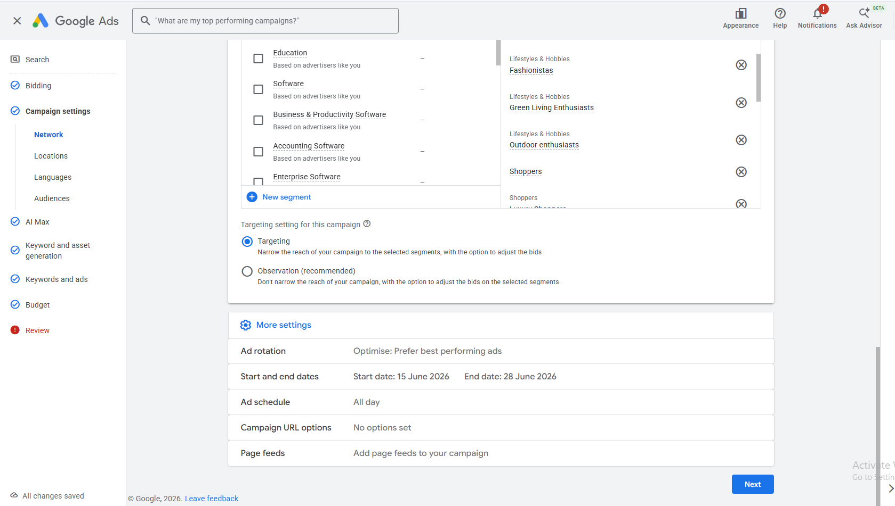

### 05. Keyword Research
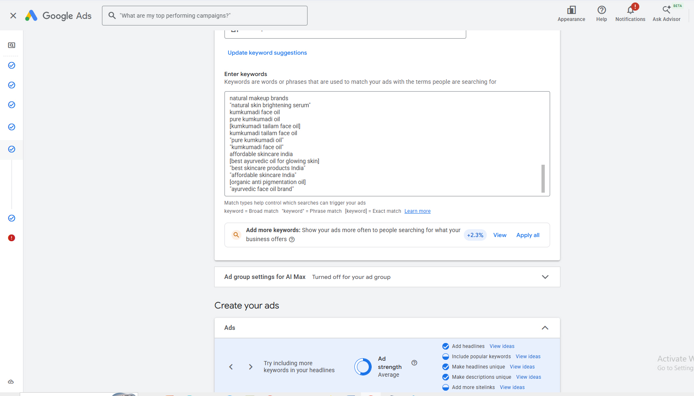

### 06. Display Path
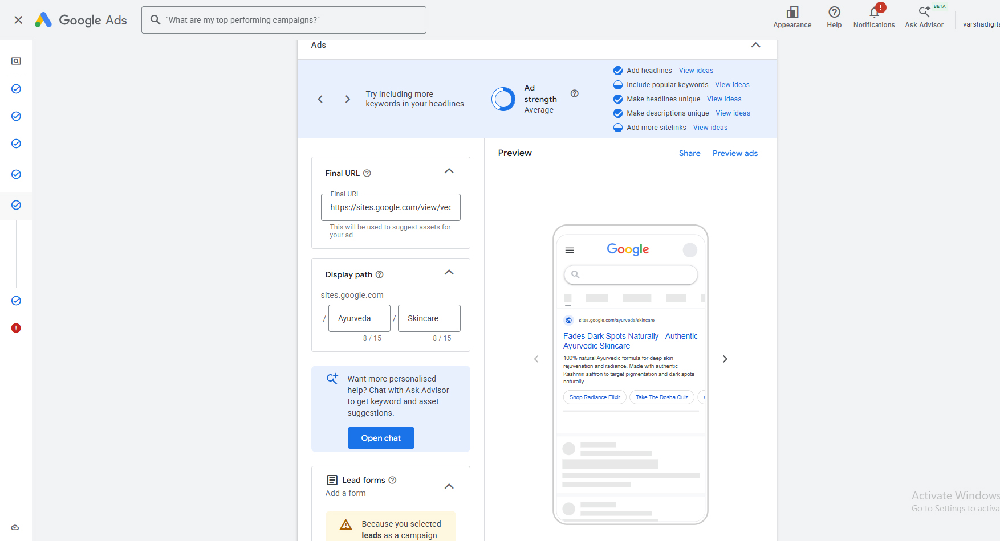

### 07. Headlines
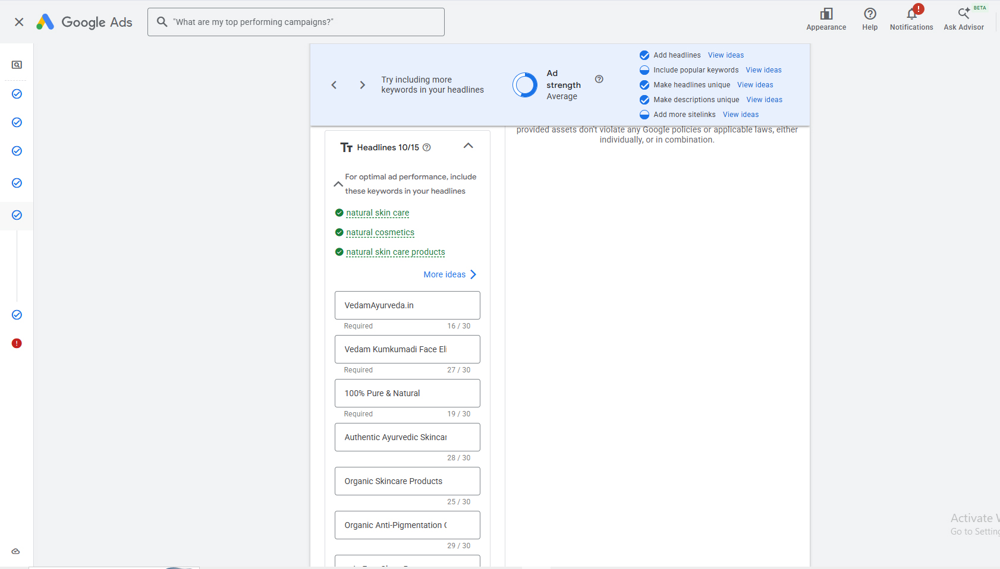

### 09. Description
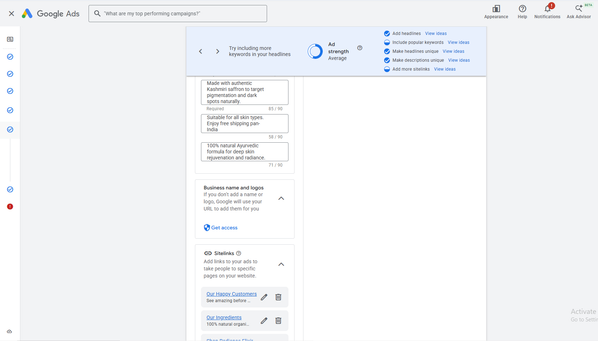

### 10. Sitelinks

### 11. Callouts
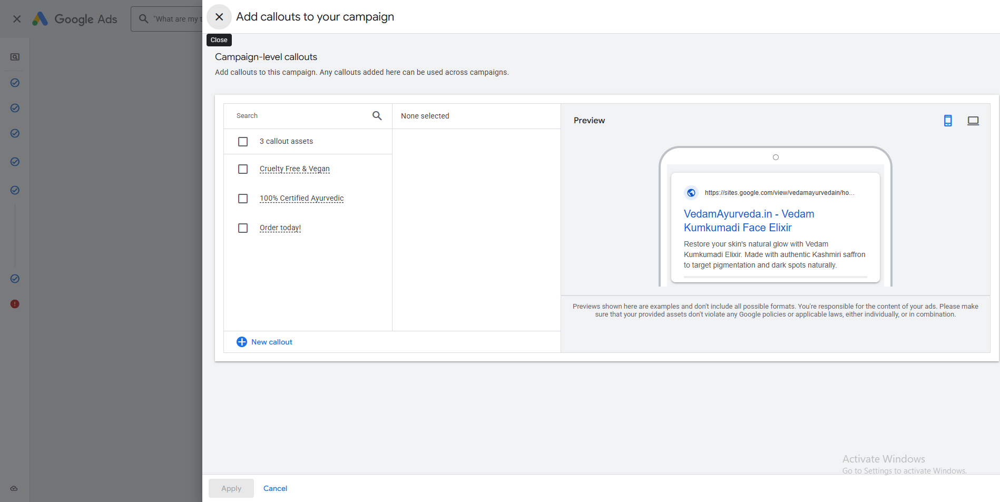

### 12. Budget
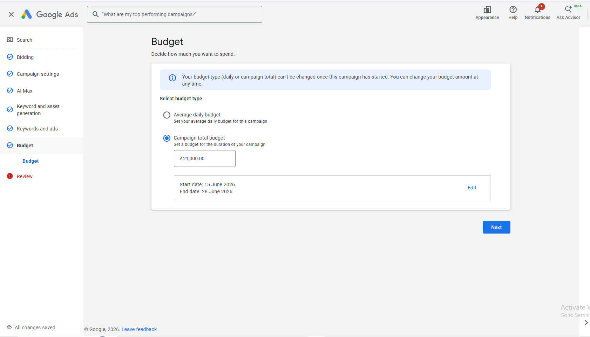

### 15. Negative Keywords
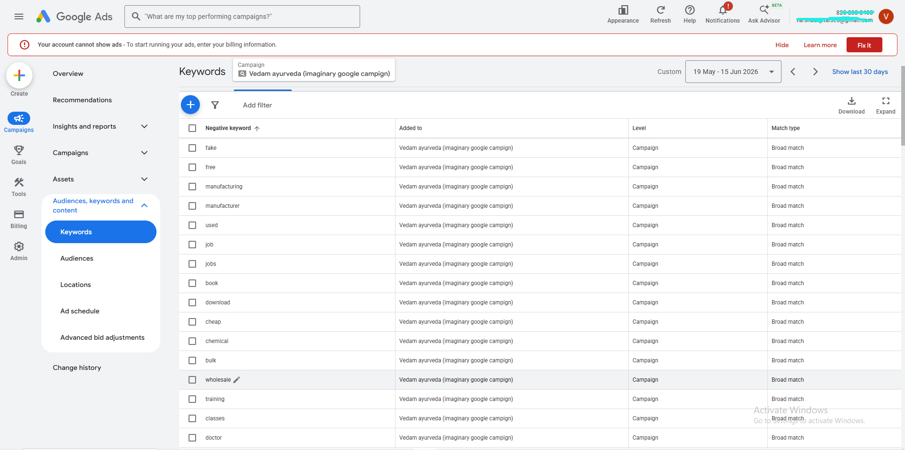

### 19. Campaign
 

### Landing Pages

### 1. Home Page
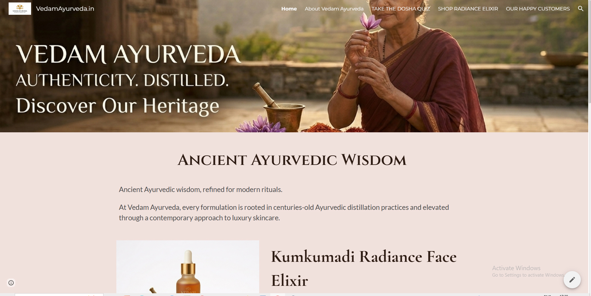

### 2. Our Ingredients

### 3.Take the Dosha Quiz

### 4. Shop Radiance Elixir
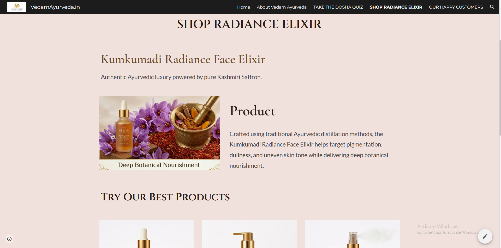

### 5. Our Happy Customers
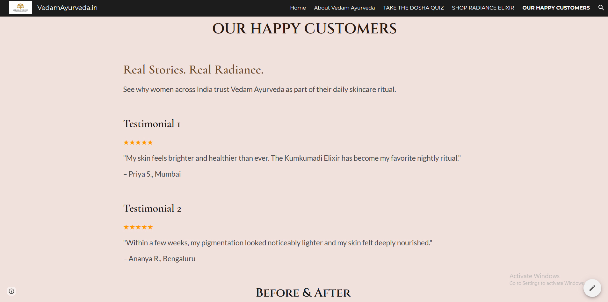

----

## 📚 Key Learnings

- Built a complete Google Ads Search Campaign.
- Learned keyword research and audience targeting.
- Created optimized landing pages using Google Sites.
- Applied Google Ads best practices.
- Improved campaign optimization and documentation skills.

---

## 👩‍💻 Author
**Varsha Prajapati**

Unified Mentor Internship Project

2026
